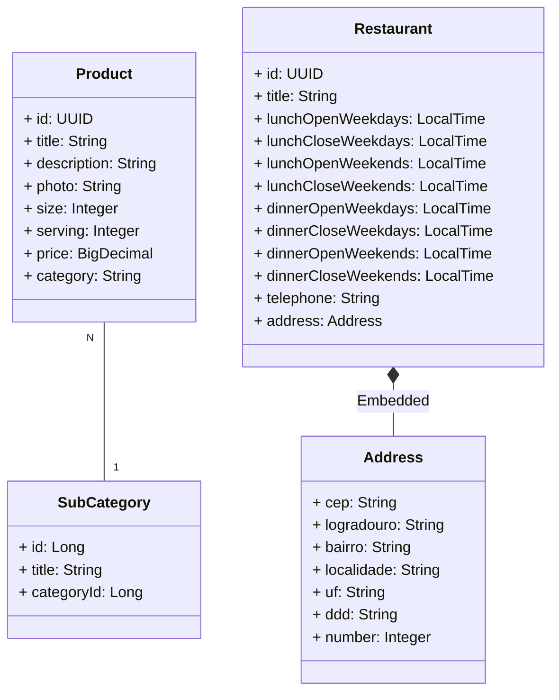

# 🥘 Lecaru Restaurant

Lecaru API REST para gerenciamento de um restaurante. Construída com Java 17 e Spring Boot.

## 📊 Diagrama de Classes

```mermaid
classDiagram
  class Product {
    + id: UUID
    + title: String
    + description: String
    + photo: String
    + size: Integer
    + serving: Integer
    + price: BigDecimal
    + category: String
  }

  class SubCategory {
    + id: Long
    + title: String
    + categoryId: Long
  }

  class Restaurant {
    + id: UUID
    + title: String
    + lunchOpenWeekdays: LocalTime
    + lunchCloseWeekdays: LocalTime
    + lunchOpenWeekends: LocalTime
    + lunchCloseWeekends: LocalTime
    + dinnerOpenWeekdays: LocalTime
    + dinnerCloseWeekdays: LocalTime
    + dinnerOpenWeekends: LocalTime
    + dinnerCloseWeekends: LocalTime
    + telephone: String
    + address: Address
  }

  class Address {
    + cep: String
    + logradouro: String
    + bairro: String
    + localidade: String
    + uf: String
    + ddd: String
    + number: Integer
  }

  Product "N" -- "1" SubCategory
  Restaurant *-- Address : Embedded
```
